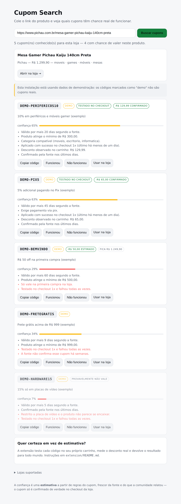
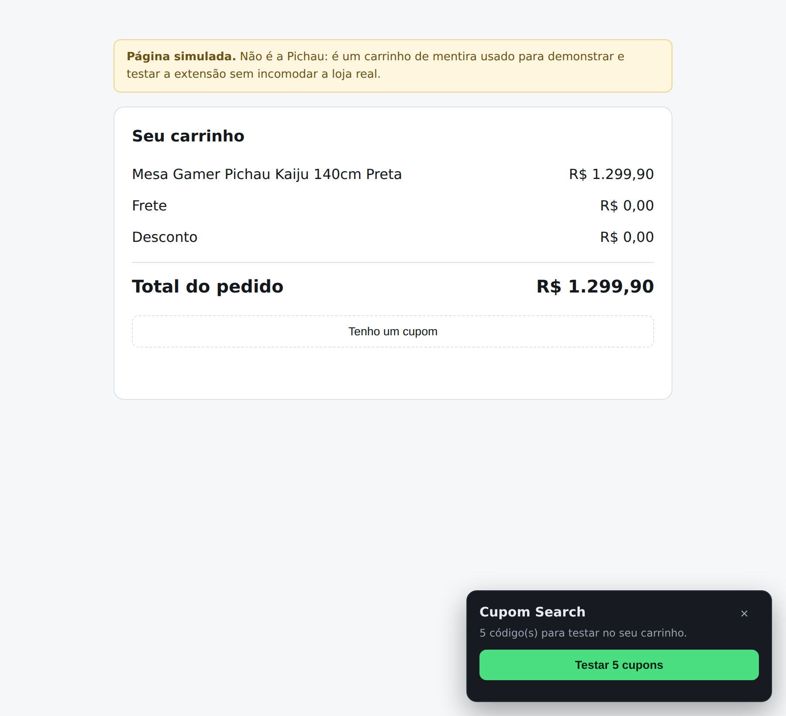
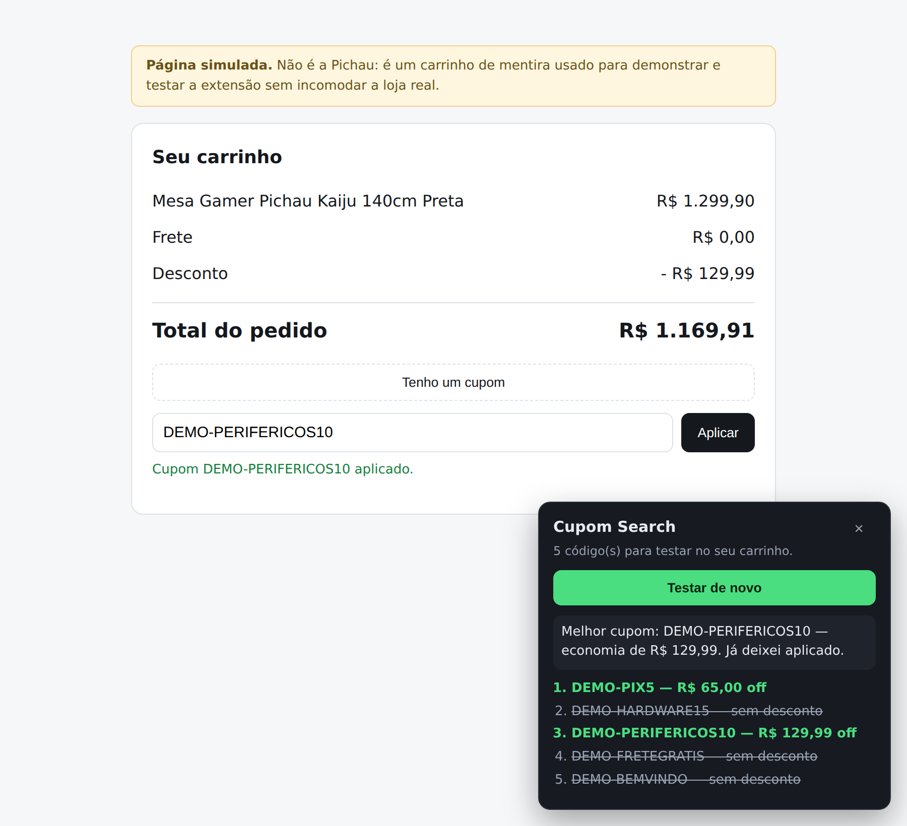

# Cupom Search

Cole o link de um produto (ex.: uma mesa na Pichau) e veja quais cupons têm chance
real de funcionar — filtrados pelas regras que se aplicam **àquele** produto,
ordenados por economia e confiança. A extensão de navegador fecha o ciclo:
testa os códigos no seu carrinho e transforma estimativa em desconto confirmado.



Cada cupom vem com o motivo da nota: o que se aplica ao produto, o que bloqueia,
e — quando a extensão já testou — o desconto que realmente apareceu no carrinho.

## Vendo funcionar

```bash
npm run demo        # sobe em modo offline, com uma página de produto salva
npm run screenshots # abre num Chromium de verdade e salva docs/screenshots/
```

| A extensão no carrinho | Depois de testar |
| --- | --- |
|  |  |

O carrinho das imagens é `fixtures/pichau-cart.html`, uma **página simulada** —
demonstra e testa a extensão sem incomodar a loja real. Os códigos `DEMO-*` não
são cupons de verdade.

## O problema real (e como o sistema resolve)

Achar cupom é fácil. **Saber se ele ainda está ativo é que é o produto** — não
existe API de validação, só o checkout da loja sabe. Testar do servidor esbarra
em Cloudflare e nos termos de uso das lojas.

A saída é onde Honey, Cuponomia e Méliuz chegaram: **testar dentro do navegador do
usuário**, no carrinho real dele. Sem robô, sem bloqueio — e ainda descobre o
desconto exato em reais. É o que a pasta `extension/` faz.

O sistema combina três sinais, nesta ordem de força:

| Sinal | De onde vem | Peso |
| --- | --- | --- |
| **Teste no checkout** | extensão aplica o código no carrinho e mede o total | até 85%, decaindo com o tempo |
| **Relato manual** | botão "funcionou / não funcionou" no site | até 35% |
| **Frescor + fonte** | há quanto tempo a fonte confirmou, e quanto ela vale | base |

Três tentativas reais sem nenhum sucesso derrubam o código para ~0 de confiança.
Uma validação de dois meses atrás quase não conta. É isso que evita o problema
clássico do setor: lista enorme de cupom morto.

## Como rodar

Requer Node 22.18+ — o projeto roda TypeScript direto, **sem build e sem
dependência em produção**.

```bash
npm install            # só dev deps (typescript, jsdom)
npm start              # http://localhost:3000
npm test               # 75 testes
npm run typecheck
node scripts/demo.ts   # demonstração offline, sem rede
```

A extensão: `chrome://extensions` → Modo do desenvolvedor → **Carregar sem
compactação** → pasta `extension/`. Detalhes e limites em
[`extension/README.md`](extension/README.md).

Docker:

```bash
docker build -t cupom-search . && docker run -p 3000:3000 -v cupom-data:/data cupom-search
```

## Configuração

Tudo opcional — sem nada configurado o app sobe com dados de demonstração
(`data/coupons.seed.json`). **Os códigos marcados como `demo` não são cupons
reais**: existem para exercitar o motor de regras.

```bash
AWIN_API_TOKEN=...  AWIN_PUBLISHER_ID=...   # feed oficial de cupons
AFFILIATE_PICHAU=awin:9999                  # link de saída com comissão
AFFILIATE_AMAZON_BR=tag:seucodigo-20
COUPON_DB_PATH=./data/db.json
```

Ver `.env.example`.

## API

| Método | Rota | O que faz |
| --- | --- | --- |
| `POST` | `/api/search` | `{ "url": "..." }` → produto + cupons ranqueados |
| `GET` | `/api/coupons?storeId=` | ranking da loja sem produto (usado no carrinho) |
| `POST` | `/api/validations` | resultado do teste da extensão no checkout |
| `POST` | `/api/feedback` | relato manual `{ storeId, code, worked }` |
| `POST` | `/api/coupons` | envio de cupom pela comunidade |
| `GET` | `/go?url=&code=` | link de saída: registra o clique e redireciona |
| `GET` | `/api/stores`, `/api/stats`, `/healthz` | catálogo, métricas, healthcheck |

## Arquitetura

```
              ┌── web/ ────────── cola o link, vê o ranking
link ──▶ API ─┤
              └── extension/ ──── testa no carrinho, devolve o desconto real
                      │
   stores.ts → fetcher.ts → product.ts → providers/ → matching.ts → db/
   qual loja   HTTP seguro   preço e      afiliado,   regras e      evidência
                             categoria    comunidade  confiança     acumulada
```

- **`core/matching.ts`** — o coração. Separa **bloqueio** (valor mínimo não
  atingido, categoria errada, vencido) de **ressalva** (só no app, primeira
  compra, preço não lido) e calcula a confiança combinando os três sinais acima.
  Usa média a posteriori de uma Beta em vez de taxa bruta, para um único
  "funcionou" não virar 100%.
- **`core/fetcher.ts`** — timeout, limite de tamanho e bloqueio de endereços
  internos: a URL vem do usuário, então SSRF é risco real.
- **`core/providers/`** — afiliado (Awin), comunidade e seed de demo, em paralelo,
  deduplicados pela fonte mais confiável.
- **`core/cache.ts`** — TTL curto por loja e por página. O caminho mais rápido
  para ser bloqueado é parecer um robô insistente.
- **`extension/lib.js`** — heurística de detecção do campo de cupom, do botão e do
  total. Seletor por loja é atalho; a heurística por rótulo/placeholder é a
  garantia, porque loja muda layout toda semana.
- **`db/store.ts`** — persistência em JSON. Trocar por Postgres é substituir esta
  classe.

## Modelo de negócio

Vale dizer em voz alta: **cobrar assinatura por lista de cupom não costuma
funcionar** — a informação é gratuita em cinco concorrentes. A receita do setor é
**comissão de afiliado**: o usuário clica no seu link, compra, a loja paga. Por
isso o `/go` existe desde o primeiro dia e registra cliques.

Competir de frente com Méliuz/Cuponomia é caro. Um nicho como hardware/setup
(Pichau, KaBuM!, Terabyte) tem ticket alto e público que pesquisa antes de
comprar — e é onde a validação por extensão vale mais.

## Limitações conhecidas

- **Os seletores da extensão não foram conferidos contra as lojas reais.** Foram
  escritos a partir dos padrões dessas plataformas; a heurística cobre o caso de
  estarem errados, mas cada loja precisa de uma passada manual.
- Lojas com proteção anti-bot podem recusar a leitura da página pelo servidor; o
  app degrada para "cupons gerais da loja" em vez de falhar.
- A categoria é heurística: cupom com regra muito específica pode cair como
  incerto em vez de bloqueado.
- O `Dockerfile` não foi construído aqui (sem daemon Docker no ambiente).
- Sem provider de afiliado configurado, os únicos cupons são os de demonstração e
  os enviados pela comunidade.

## Próximos passos

1. Conferir os seletores loja a loja com o carrinho aberto.
2. Cadastro nas redes de afiliados (receita + cupons oficiais no mesmo passo).
3. Fila de revalidação: reaplicar cupons antigos periodicamente via extensão.
4. Alerta de preço — retém usuário entre compras, que é o problema de todo site
   de cupom.
